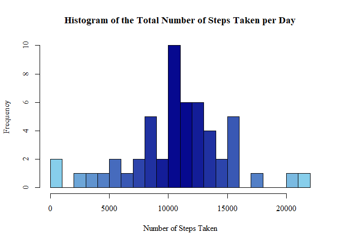
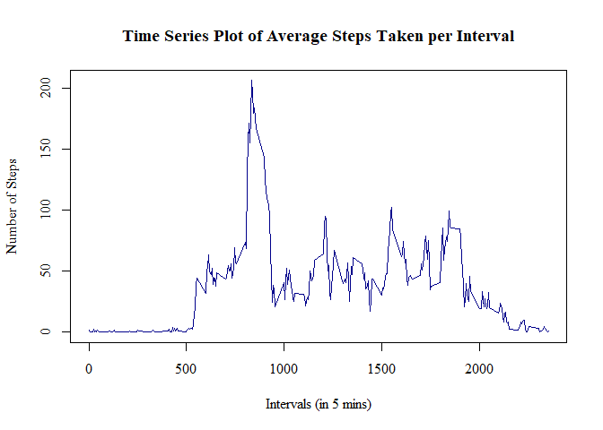
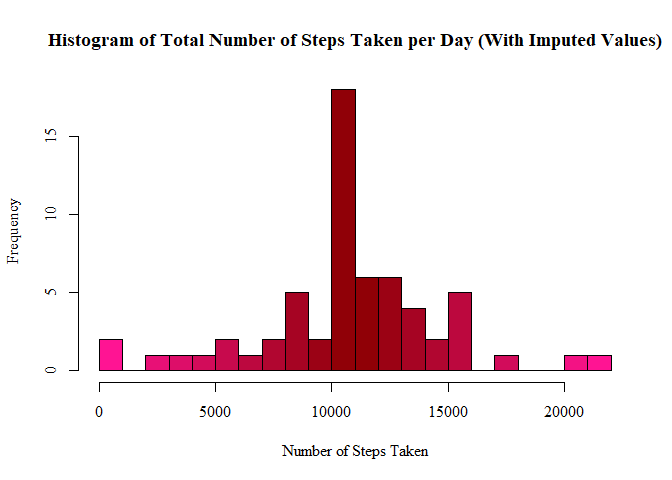
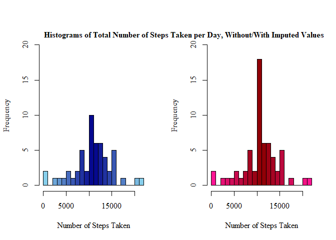
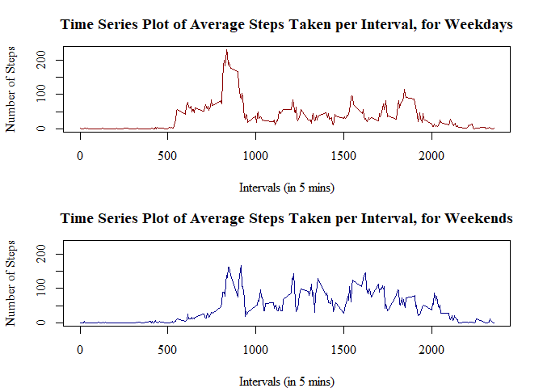

## Question 1: Code for reading in the dataset and/or processing the data

```r
activity<-read.csv("activity.csv")
```

Exploring the basics of this data

```r
dim(activity)
```

```
## [1] 17568     3
```

```r
names(activity)
```

```
## [1] "steps"    "date"     "interval"
```

```r
head(activity)
```

```
##   steps       date interval
## 1    NA 2012-10-01        0
## 2    NA 2012-10-01        5
## 3    NA 2012-10-01       10
## 4    NA 2012-10-01       15
## 5    NA 2012-10-01       20
## 6    NA 2012-10-01       25
```

```r
str(activity)
```

```
## 'data.frame':	17568 obs. of  3 variables:
##  $ steps   : int  NA NA NA NA NA NA NA NA NA NA ...
##  $ date    : chr  "2012-10-01" "2012-10-01" "2012-10-01" "2012-10-01" ...
##  $ interval: int  0 5 10 15 20 25 30 35 40 45 ...
```

```r
# total number of missing data
sum(is.na(activity$steps))/dim(activity)[[1]]
```

```
## [1] 0.1311475
```

```r
# transforming the date column into date format using lubridate
library(lubridate)
```

```
## 
## Attaching package: 'lubridate'
```

```
## The following objects are masked from 'package:base':
## 
##     date, intersect, setdiff, union
```

```r
activity$date<-ymd(activity$date)
length(unique(activity$date))
```

```
## [1] 61
```

### Question 2: What is mean total number of steps taken per day?

```r
data <- activity[!(is.na(activity$steps)), ]
totalStepsDay <- aggregate(steps ~ date, data, sum)
head(totalStepsDay)
```

```
##         date steps
## 1 2012-10-02   126
## 2 2012-10-03 11352
## 3 2012-10-04 12116
## 4 2012-10-05 13294
## 5 2012-10-06 15420
## 6 2012-10-07 11015
```

```r
paletteBlue <- colorRampPalette(c("skyblue", "darkblue", "skyblue"))
hist(totalStepsDay$steps, breaks=20, xlab="Number of Steps Taken", 
     main="Histogram of the Total Number of Steps Taken per Day",
     col=paletteBlue(22), family="serif")
```

<!-- -->

```r
library(dplyr)
```

```
## 
## Attaching package: 'dplyr'
```

```
## The following objects are masked from 'package:lubridate':
## 
##     intersect, setdiff, union
```

```
## The following objects are masked from 'package:stats':
## 
##     filter, lag
```

```
## The following objects are masked from 'package:base':
## 
##     intersect, setdiff, setequal, union
```

```r
totalStepsSummary <- summarise(totalStepsDay, meanOfTotalSteps=mean(totalStepsDay$steps),
                               medianOfTotalSteps=median(totalStepsDay$steps))
print(totalStepsSummary)
```

```
##   meanOfTotalSteps medianOfTotalSteps
## 1         10766.19              10765
```

Therefore the mean value calculated is **10766.19**, and the median value **10765**.

### Question 3: What is the average daily activity pattern?

```r
meanStepsInterval <- aggregate(steps ~ interval, data, mean)
head(meanStepsInterval)
```

```
##   interval     steps
## 1        0 1.7169811
## 2        5 0.3396226
## 3       10 0.1320755
## 4       15 0.1509434
## 5       20 0.0754717
## 6       25 2.0943396
```

```r
plot(x=meanStepsInterval$interval, y=meanStepsInterval$steps, type="l",
     main="Time Series Plot of Average Steps Taken per Interval",
     ylab="Number of Steps", xlab="Intervals (in 5 mins)",
     col="darkblue", lwd=1.5, family="serif")
```

<!-- -->

```r
meanStepsInterval[grep(max(meanStepsInterval$steps), meanStepsInterval$steps), ]
```

```
##     interval    steps
## 104      835 206.1698
```

So the interval with the maximum number of steps is interval **835**.

### Question 4: Imputing missing value

```r
anyNA(activity)
```

```
## [1] TRUE
```

```r
data.frame(steps=sum(is.na(activity$steps)), 
           interval=sum(is.na(activity$interval)), 
           date=sum(is.na(activity$date)))
```

```
##   steps interval date
## 1  2304        0    0
```

It can be seen that all 2304 NA values are contained within the steps variable.

Therefore an imputing strategy must be devised to replace all of these missing values with usable numeric measurements. To do so, I decided to replace each missing value with the mean value for the same interval, averaged across all days.

I used a for loop to achieve this, first testing if each observation was an NA value, and if so, replacing it with the mean average for that


```r
imputedData <- activity
for(x in 1:17568) {
    if(is.na(imputedData[x, 1])==TRUE) {
        imputedData[x, 1] <- meanStepsInterval[meanStepsInterval$interval %in% imputedData[x, 3], 2]
    }
}
head(imputedData)
```

```
##       steps       date interval
## 1 1.7169811 2012-10-01        0
## 2 0.3396226 2012-10-01        5
## 3 0.1320755 2012-10-01       10
## 4 0.1509434 2012-10-01       15
## 5 0.0754717 2012-10-01       20
## 6 2.0943396 2012-10-01       25
```

Now that the NA values have been replaced, a histogram from the imputed data can be created. This histogram should indicate the frequency of the total number of steps taken per day. Therefore again, the data must be grouped and "summed" by day.


```r
imputedTotalStepsDay <- aggregate(steps ~ date, imputedData, sum)
head(imputedTotalStepsDay)
```

```
##         date    steps
## 1 2012-10-01 10766.19
## 2 2012-10-02   126.00
## 3 2012-10-03 11352.00
## 4 2012-10-04 12116.00
## 5 2012-10-05 13294.00
## 6 2012-10-06 15420.00
```

Creating the histogram:


```r
paletteRed <- colorRampPalette(c("deeppink", "darkred", "deeppink"))
hist(imputedTotalStepsDay$steps, breaks=20, xlab="Number of Steps Taken", 
     main="Histogram of Total Number of Steps Taken per Day (With Imputed Values)",
     col=paletteRed(22), family="serif")
```

<!-- -->

The question then asks for calculation of the mean and median total number of steps taken per day, which can be calculated using the summarise function.


```r
imputedStepsSummary <- summarise(imputedTotalStepsDay, 
                                 meanOfTotalSteps=mean(imputedTotalStepsDay$steps), 
                                 medianOfTotalSteps=median(imputedTotalStepsDay$steps))  
print(imputedStepsSummary)
```

```
##   meanOfTotalSteps medianOfTotalSteps
## 1         10766.19           10766.19
```

This a similar calculation to the one completed at the start of the assignment, (without the imputed values,) and thus they can be compared.


```r
rbind(totalStepsSummary, imputedStepsSummary)
```

```
##   meanOfTotalSteps medianOfTotalSteps
## 1         10766.19           10765.00
## 2         10766.19           10766.19
```

The values of the two data sets are very similar, if not exactly the same, due to the use of averaging functions when imputing the NA measurements. The mean values are the same, at **10766.19** steps, while the median value is slightly larger for the imputed data set, at **10766.19** steps, rather than **10765** steps.

If histograms of the two data sets (imputed and non-imputed) are compared:


```r
par(mfrow = c(1, 2))
hist(totalStepsDay$steps, breaks=20, xlab="Number of Steps Taken", 
     col=paletteBlue(22), family="serif", ylim=c(0, 20), main=NULL)
hist(imputedTotalStepsDay$steps, breaks=20, xlab="Number of Steps Taken", 
     col=paletteRed(22), family="serif", ylim=c(0, 20), main=NULL)
mtext("Histograms of Total Number of Steps Taken per Day, Without/With Imputed Values",
      adj=0.95, family="serif", font=2)
```

<!-- -->

It can be seen that the frequency of values increases in the second histogram, which is expected, due to the imputed values. 

More explanations for the differences between the non and imputed data sets can be seen by looking at the NA values grouped by their date variable.


```r
naByDate <- activity[is.na(activity$steps), ]
table(naByDate$date)
```

```
## 
## 2012-10-01 2012-10-08 2012-11-01 2012-11-04 2012-11-09 2012-11-10 2012-11-14 
##        288        288        288        288        288        288        288 
## 2012-11-30 
##        288
```

As there are exactly 288 intervals measured for each day:


```r
length(unique(data$interval))
```

```
## [1] 288
```

It is therefore shown by the above table, that in the initial data set, missing observations are due to entirely missed days, (8 of the days) where no measurements were made whatsoever. This therefore reinforces that the imputing technique used, of utilising average interval data, was likely more useful than potentially using average daily data.

### Question 5: Are there differences in activity patterns between weekdays and weekends?

The question indicates that the imputed data set should be used to answer this problem.  
To help in answering this question, firstly a new factor variable should be created within the data frame. This should indicate whether each day is a "weekday" or a "weekend".

To achieve this, I used the weekdays function to automatically calculate the day of the week each day resided upon, (Monday, Tuesday, etc.) Next, I wrote a for loop, which would assign the factor value "weekend" to all rows it read as having the values "Saturday" or "Sunday", and assign "weekday" to the others.


```r
daysData <- imputedData
daysData$days <- weekdays(daysData$date)
daysData$weekday <- as.character(rep(0, times=17568))
for(x in 1:17568) {
    if(daysData[x, 4] %in% c("Saturday", "Sunday")) {
        daysData[x, 5] <- "weekend"
    } else {
        daysData[x, 5] <- "weekday"
    }
}
daysData$weekday <- factor(daysData$weekday)
head(daysData)
```

```
##       steps       date interval   days weekday
## 1 1.7169811 2012-10-01        0 Monday weekday
## 2 0.3396226 2012-10-01        5 Monday weekday
## 3 0.1320755 2012-10-01       10 Monday weekday
## 4 0.1509434 2012-10-01       15 Monday weekday
## 5 0.0754717 2012-10-01       20 Monday weekday
## 6 2.0943396 2012-10-01       25 Monday weekday
```

To compare the weekday and weekend data, and create two plots of the average number of steps taken per interval, the data has to be split into two groups of weekday/weekend data, using the newly created variable.


```r
weekdayData <- daysData[daysData$weekday=="weekday", ]
weekendData <- daysData[daysData$weekday=="weekend", ]
```

Next, the average number of steps per interval is calculated, much like it has been done in previous questions.


```r
weekdayMean <- aggregate(steps ~ interval, weekdayData, mean)
weekendMean <- aggregate(steps ~ interval, weekendData, mean)
```

Finally the panel plot is created. The x axis indicates each 5 minute interval, and the y axis shows the average number of steps taken. The two plots are divided into weekday, and weekend data.


```r
par(mfrow=c(2, 1), mar=c(4, 4.1, 3, 2.1))
plot(weekdayMean$interval, weekdayMean$steps, type="l",
     main="Time Series Plot of Average Steps Taken per Interval, for Weekdays",
     xlab="Intervals (in 5 mins)", ylab="Number of Steps", family="serif",
     col="darkred", lwd=1.5, ylim=c(0, 230))
plot(weekendMean$interval, weekendMean$steps, type="l",
     main="Time Series Plot of Average Steps Taken per Interval, for Weekends",
     xlab="Intervals (in 5 mins)", ylab="Number of Steps", family="serif",
     col="darkblue", lwd=1.5, ylim=c(0, 230))
```

<!-- -->
